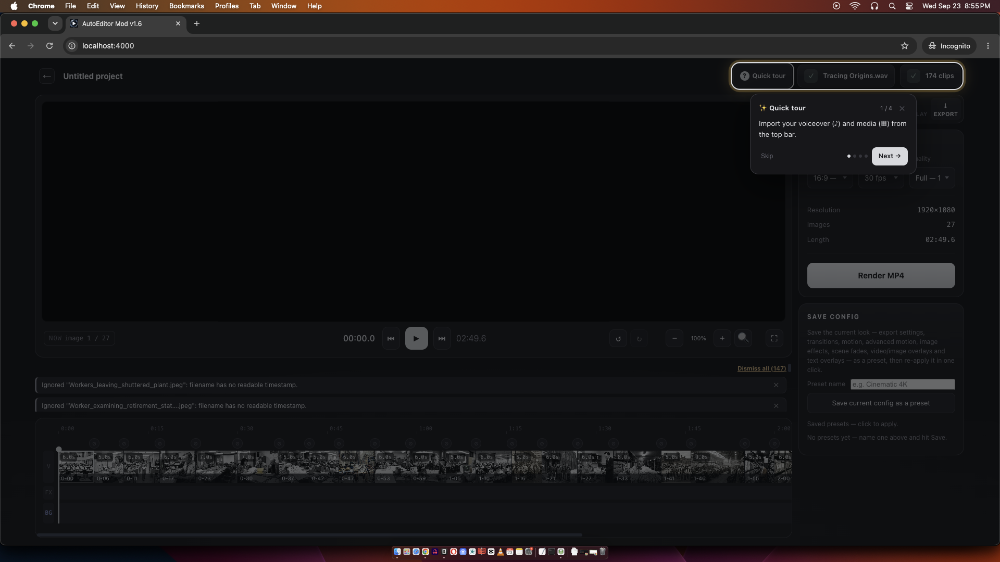
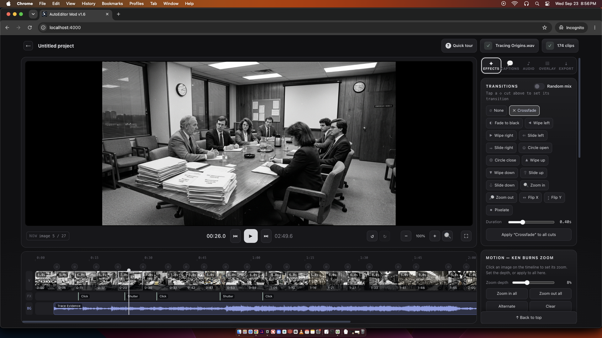
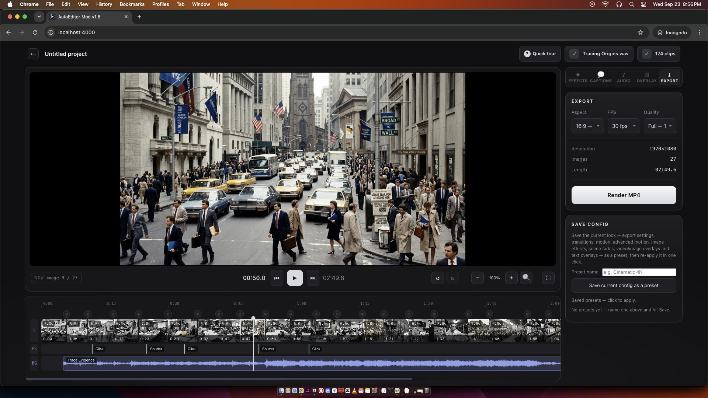
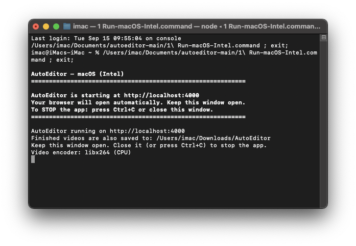

# AutoEditor Mod

Turn timestamp-named images plus a voiceover into an MP4 — entirely on your own machine. Nothing is uploaded to the internet.

## Screenshots







## Features

- **Image Effects** — apply one of 12 effects per clip (B&W, Sepia, Warm, Cool, Film Grain, Noise, Heavy Noise, Vignette, VHS, Grunge, Dust) with an intensity slider.
- **Editing** — drag-and-drop image import, per-clip trim, fit mode (cover / contain), drag-reorder in the timeline.
- **Transitions** — fade, wipe, zoom, slide with adjustable duration.
- **Audio** — multiple audio layers, per-layer volume, automatic voice/music sync.
- **Sound Effects** — six built-in sounds (Whoosh, Boom, Correct, Click, Shutter, Subtle) plus your own .mp3/.wav uploads; drop markers on the FX track, drag to move, set each marker's volume, and fade the whole effects bed with a master volume.
- **Background Music** — a dedicated BG track for music beds: add an audio layer, click the BG track to place it, drag clips to move them, trim either edge, and set per-clip volume with fade in/out.
- **Timed Text Overlays** — unlimited titles, labels, or call-outs anywhere on the frame, each with its own text, start/end time, position, size, color, and opacity.
- **Text** — subtitle overlay from SRT/SSA or timestamped transcripts, with style, size, and entrance-animation controls.
- **Random Mix & Favorites** — in the Motion and Image Effects panels, flip Random mix to pick from any effect set (like the transitions panel) or star the ones you like.
- **Save Config Presets** — save the whole look of a project — export settings (aspect, fps, quality), transitions, motion, image effects, scene fades, overlays, and text overlays — as a named preset and re-apply it in one click.
- **Overlays & Watermark** — video/image overlay with opacity and blend modes; optional persistent watermark.
- **Export** — full resolution, 720p, or **4K UHD**; 24/30/60 fps; WebCodecs (browser-native) and FFmpeg rendering with a real-time progress bar.
- **Project** — save and resume full project state as a JSON file.

## Quick Start

Requires **Node.js** (LTS, from https://nodejs.org). Then run the launcher for your platform:

| Platform | Run |
| --- | --- |
| Windows | Double-click `1 Run-Windows.bat` |
| macOS (Apple Silicon / M-series) | Double-click `1 Run-macOS-Silicon.command` |
| macOS (Intel) | Double-click `1 Run-macOS-Intel.command` |
| Linux | `./1 Run-Linux.sh` in a terminal |
| Android (Termux) | `bash start.sh` in the `AutoEditorModv1.6-Android` folder |

First run only: the script installs dependencies and builds the UI once. Afterwards it starts the app at http://localhost:4000, opens your browser, and auto-saves finished videos to `~/Downloads/AutoEditor`.

**Keep the launcher window open** while you use the app — closing it (or pressing Ctrl+C) stops the server. Requires Node.js on PATH.



Video Guide link: https://youtu.be/F0AKNE4mDjs?si=KKQsVijokqS7zfHF

### Android (Termux)

The desktop launchers build from source; on Android you use the ready-made `AutoEditorModv1.6-Android.zip` distributable instead:

1. Install **Termux** from the Google Play Store, open it, and run `termux-setup-storage` (tap **Allow**), then `pkg install -y unzip`.
2. Copy `AutoEditorModv1.6-Android.zip` into the phone's **Download** folder.
3. Run:

```bash
cd ~/storage/downloads
unzip AutoEditorModv1.6-Android.zip
cd AutoEditorModv1.6-Android
bash start.sh
```

On first run `start.sh` installs Node.js + ffmpeg, takes a wake-lock (renders survive the screen turning off), and starts the server on port 4000. Open **http://localhost:4000** in the phone's browser. If a phone freezes Termux when the screen locks, set **Settings → Apps → Termux → Battery → Unrestricted**. See [`docs/termux-android-setup.md`](docs/termux-android-setup.md) for the full guide.

Android Video Guide link: https://youtu.be/1DSjtlKI_lA?si=Lp_EJn-UN5jqLtob

### Disclosure
I'm not a professional developer, im just a creator that vibe coded this app that suits my workflow in content creation using this AutoEditor.

## Changelog

See [`dist-assets/changelog.txt`](dist-assets/changelog.txt) for version history. Current: **Version 1.6**.

## Credits

AutoEditor Mod is a modified version of the original **AutoEditor** by **Siddique** (TryAIToday): https://github.com/codewithsiddique-04/autoeditor
